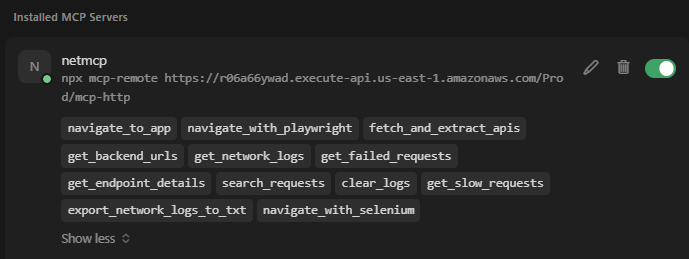
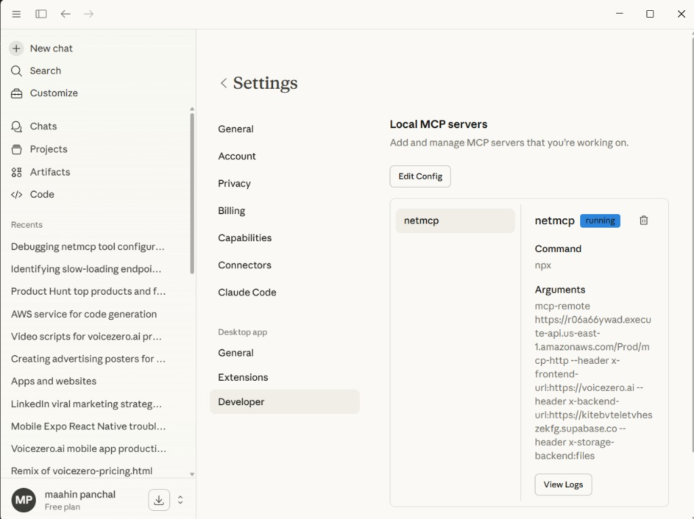

# 🎯 NetMCP – AI Network Inspector

> **Capture browser & API traffic, discover backend URLs, and inspect failed requests** — from **[Cursor](https://cursor.com)** and **[Claude Code](https://claude.ai/code)** via MCP.

[](https://aws.amazon.com/)
[](https://modelcontextprotocol.io/)
[](https://python.org/)

---

## ✨ What is this?

**NetMCP** is an **MCP (Model Context Protocol) server** that lets AI assistants (Cursor, Claude Code, etc.):

| Feature | Description |
|--------|-------------|
| 🌐 **Capture network traffic** | Open any URL in a browser (Playwright) and store every request — including your **Supabase** or other backend APIs. |
| 🔍 **Discover backend URLs** | No browser? Use **`fetch_and_extract_apis`** to GET a page, parse HTML/JS, and find API/backend URLs (works on **Lambda**). |
| ❌ **Inspect failed requests** | `get_failed_requests` and `search_requests` to see status ≥ 400 and debug edge functions. |
| 📁 **File or DynamoDB** | Use `storage_backend: "files"` locally (JSONL file) or **DynamoDB** when deployed to AWS. |

Perfect for **VoiceZero.ai**, **Supabase**-backed apps, or any frontend + backend you want to inspect from your IDE.

---

## 🚀 Use in Cursor

1. **Add NetMCP to Cursor**
   - Open **Cursor Settings → MCP** (or edit your MCP config file).
   - Add the `netmcp` server. Example for the **hosted Lambda**:

   ```json
   {
     "mcpServers": {
       "netmcp": {
         "command": "npx",
         "args": [
           "mcp-remote",
           "https://r06a66ywad.execute-api.us-east-1.amazonaws.com/Prod/mcp-http"
         ]
       }
     },
     "netmcp": {
       "frontend_url": "https://your-app.com",
       "backend_url": "https://your-supabase.supabase.co",
       "storage_backend": "files"
     }
   }
   ```

2. **In Cursor chat**, you can ask the AI to:
   - *“Use netmcp and open voicezero.ai, then show me get_network_logs”*
   - *“Use netmcp get_failed_requests and check if any Supabase edge functions failed”*
   - *“Use fetch_and_extract_apis on https://example.com and then get_backend_urls”*

3. **Tools you get**
   - `navigate_with_playwright` / `navigate_to_app` – capture traffic (needs Playwright locally).
   - `fetch_and_extract_apis` – discover API URLs **without a browser** (works on Lambda).
   - `get_network_logs` / `get_failed_requests` / `get_backend_urls` / `search_requests` – query stored requests.



*Cursor: Installed MCP Servers showing netmcp using `.../Prod/mcp-http` and the list of tools (navigate_to_app, fetch_and_extract_apis, get_backend_urls, etc.).*

---

## 🧠 Use in Claude Code / Claude Desktop

**Config file location:**  
- **Windows:** `%APPDATA%\Claude\claude_desktop_config.json`  
- **macOS:** `~/Library/Application Support/Claude/claude_desktop_config.json`

Use this exact URL in the args: **`.../Prod/mcp-http`** (not `.../Prod/mcp` or `.../Prod/mcp/`). You can pass frontend/backend/storage via headers as below.

### Example `claude_desktop_config.json`

```json
{
  "mcpServers": {
    "netmcp": {
      "command": "npx",
      "args": [
        "mcp-remote",
        "https://r06a66ywad.execute-api.us-east-1.amazonaws.com/Prod/mcp-http",
        "--header",
        "x-frontend-url:https://voicezero.ai",
        "--header",
        "x-backend-url:https://kitebvteletvheszekfg.supabase.co",
        "--header",
        "x-storage-backend:files"
      ]
    }
  },
  "preferences": {
    "sidebarMode": "chat"
  }
}
```

Replace the URL and header values with your own frontend, backend, and optional `x-storage-backend` (e.g. `files` for local file storage).

**In the UI:** Settings → Developer → Local MCP servers → Edit Config, or paste the above into your config file.



*Claude Desktop: Settings → Developer → Local MCP servers. Use `/mcp-http` in the URL and optional `--header` args for frontend/backend/storage.*

1. **Configure MCP** in Claude Desktop / Claude Code to point at the NetMCP endpoint (Lambda `.../Prod/mcp-http` or local `http://localhost:8000/mcp`).
2. Use the same structure in your config: `mcpServers.netmcp` with `args` including the full URL and optional `--header x-frontend-url:...` etc.
3. In conversation, ask Claude to **use the netmcp tools** (e.g. *“Use NetMCP fetch_and_extract_apis for https://myapp.com and get_backend_urls”*).

---

## 📂 Repo layout

```
Awsmcp/
├── README.md                 ← You are here (overview + Cursor & Claude)
├── netmcp/
│   ├── README.md            ← Full NetMCP docs (tools, deploy, storage)
│   ├── mcp.json              ← MCP client config (frontend_url, backend_url, storage_backend)
│   ├── mcp-server/           ← FastAPI + FastMCP (Python)
│   │   ├── main.py           ← Lambda handler + /mcp-http, /ingest
│   │   ├── tools.py          ← MCP tools (navigate, get_network_logs, fetch_and_extract_apis, …)
│   │   ├── api_extract.py    ← No-browser API URL extraction
│   │   ├── storage.py        ← Storage factory (files vs DynamoDB)
│   │   └── ...
│   ├── infra/                ← AWS SAM (Lambda + API Gateway + DynamoDB)
│   │   ├── template.yaml
│   │   ├── DEPLOY.md         ← sam build / deploy + curl tests
│   │   └── samconfig.toml
│   ├── browser-extension/    ← Chrome extension (DevTools → ingest)
│   └── proxy/                ← Node proxy (optional, forwards to ingest)
└── .gitignore
```

---

## ⚡ Quick start (local)

```bash
cd netmcp/mcp-server
pip install -r requirements.txt
# Optional: copy .env.example to .env and set FRONTEND_URL, BACKEND_URL, STORAGE_BACKEND=files
python main.py
# → http://localhost:8000  (health: /health, MCP: /mcp, ingest: /ingest)
```

Then in Cursor or Claude Code, point MCP at `http://localhost:8000/mcp` (see [netmcp/README.md](netmcp/README.md) for local `mcp.json`).

---

## 🛠 Deploy to AWS (Lambda)

```bash
cd netmcp/infra
export PIP_PLATFORM=manylinux2014_x86_64   # Windows: use Linux wheels
sam build
sam deploy --no-confirm-changeset --parameter-overrides "FrontendUrl=https://your-app.com" "BackendUrl=https://your-supabase.supabase.co" --capabilities CAPABILITY_IAM
```

See **[netmcp/infra/DEPLOY.md](netmcp/infra/DEPLOY.md)** for parameter details and curl/PowerShell tests.

---

## 📖 Full documentation

- **[netmcp/README.md](netmcp/README.md)** – All MCP tools, storage backends (`files` vs DynamoDB), VoiceZero.ai + Supabase setup, browser extension, proxy, and Docker.

---

## 📄 License

See repository license file (if present). NetMCP is provided as-is for use with Cursor, Claude Code, and other MCP-compatible clients.
